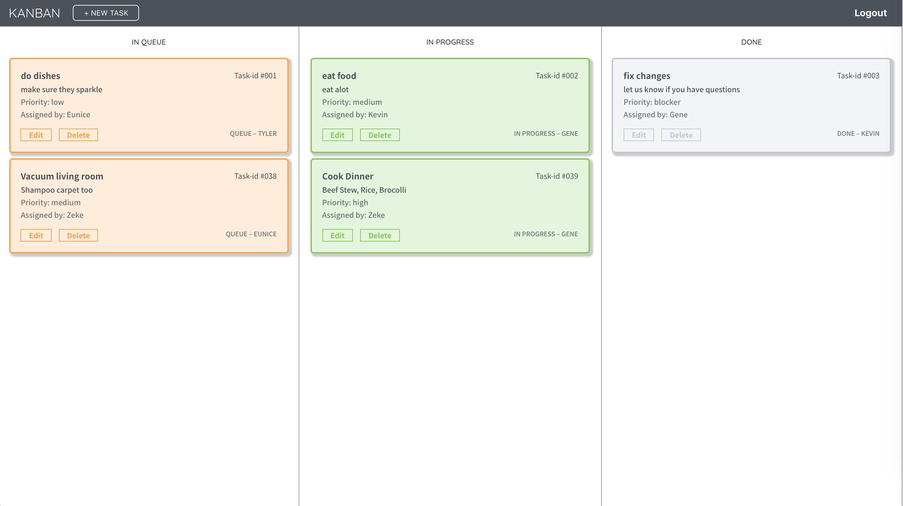
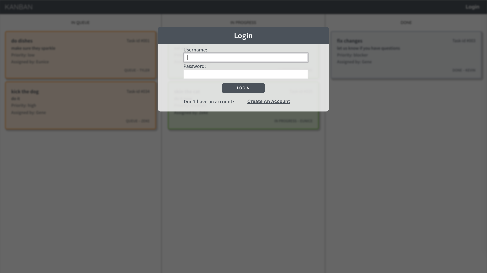

# React Kanban

A digital Kanban Board (task manager) built with React, Redux and PostgreSQL 

> "The Kanban technique emerged in the late 1940s as Toyota’s reimagined approach to manufacturing and engineering. ... The system’s highly visual nature allowed teams to communicate more easily on what work needed to be done and when. It also standardized cues and refined processes, which helped to reduce waste and maximize value." - [via LeanKit.com](http://leankit.com/learn/kanban/kanban-board/)

## Features

- Full authentication & Password encryption
- Client-side & Server-side Session Management

## Technologies & Frameworks

* React
* Redux
* Redux-thunk
* Express
* Express Session
* Redis
* Passport.js
* Bcryptjs
* Bookshelf.js
* Knex.js
* PostgreSQL
* Docker
* Sass

## Screenshots

___

